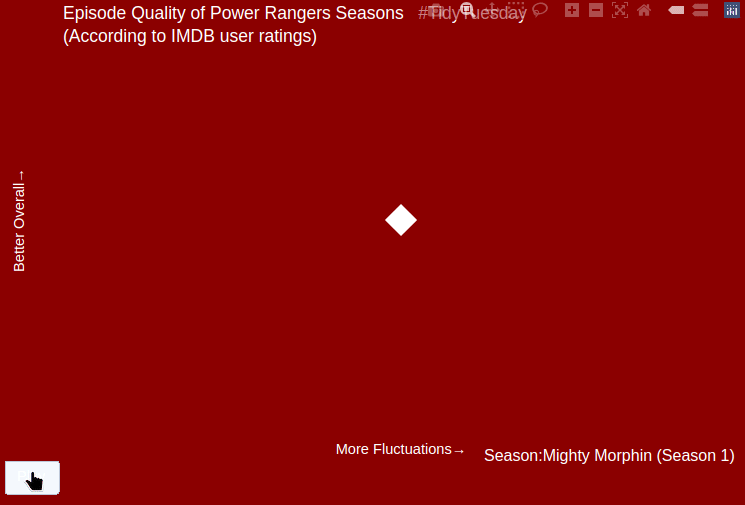
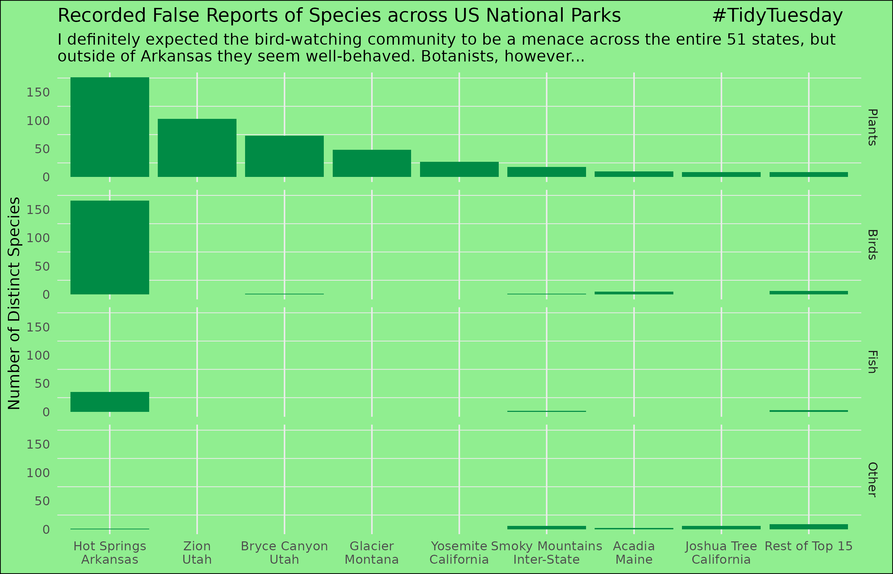
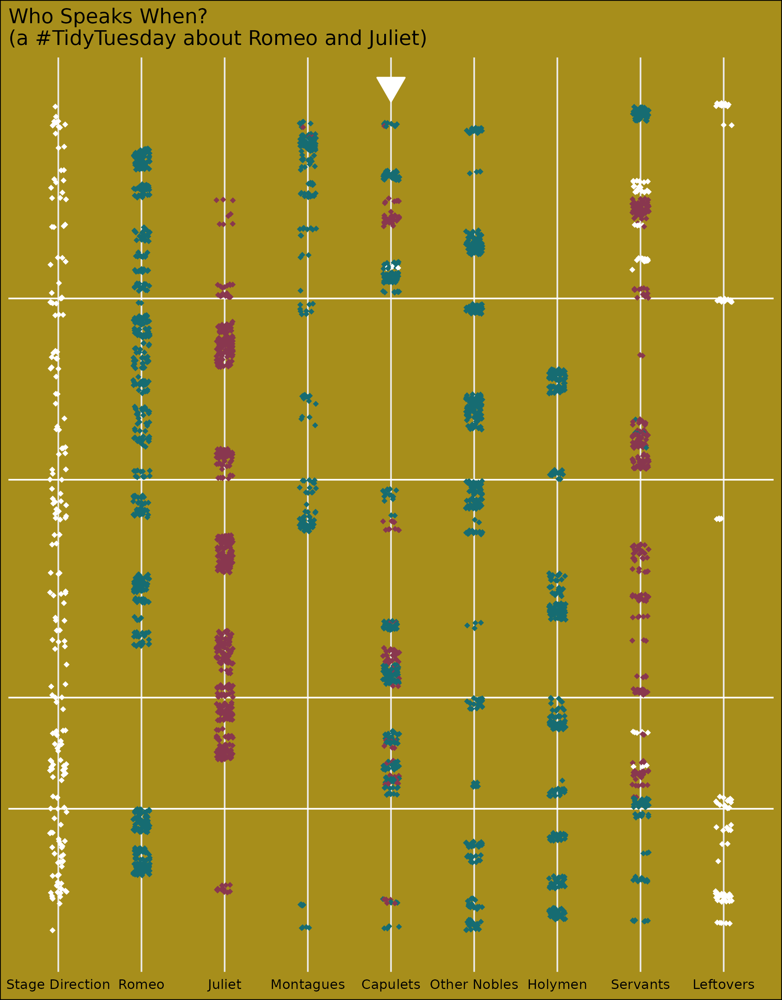
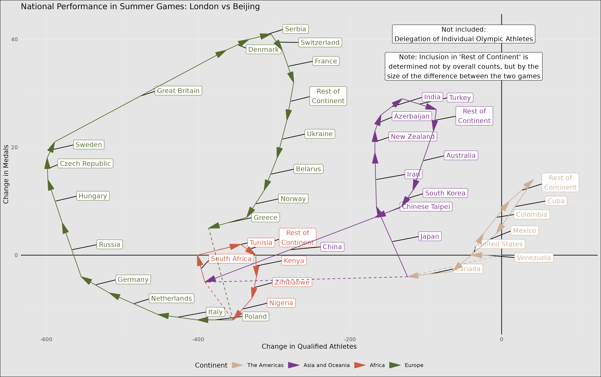
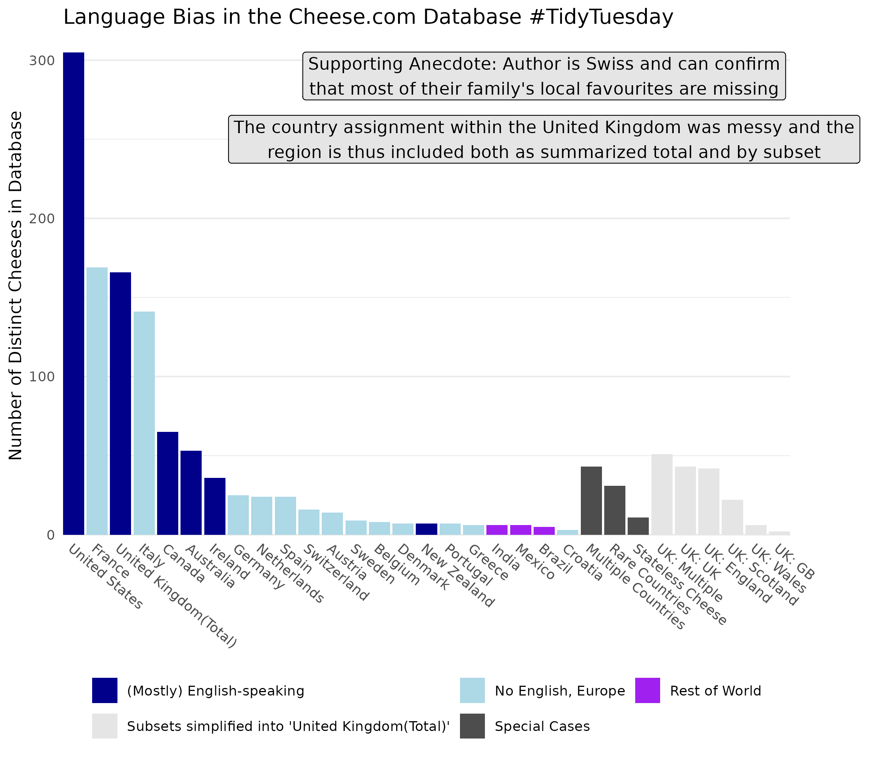

# The *#TidyTuesday* Works of Christoph Blapp

#TidyTuesday is an initiative of the Data Science Learning Community to provide a dataset each week for shared visualization practice. During a period of unemployment in mid-2024, I decided to start participating to keep my skills sharp. Any code created as part of that effort has been and will be stored within this repository.

## Some Highlights so far

Power Rangers Episode Ratings: *A look at seasons across time*

The Distributions of Species across US National Parks: *Characterizing false reports about local species*

The script of Shakespeare's Romeo and Juliet: *Which characters reads each line split by affiliation and gender*

Summer Olympics Results: *The winners and losers of London compared to Beijing*

The Cheese.com list of (supposedly) all cheese: *Evidence of under-representation of regions due to the language barrier*
